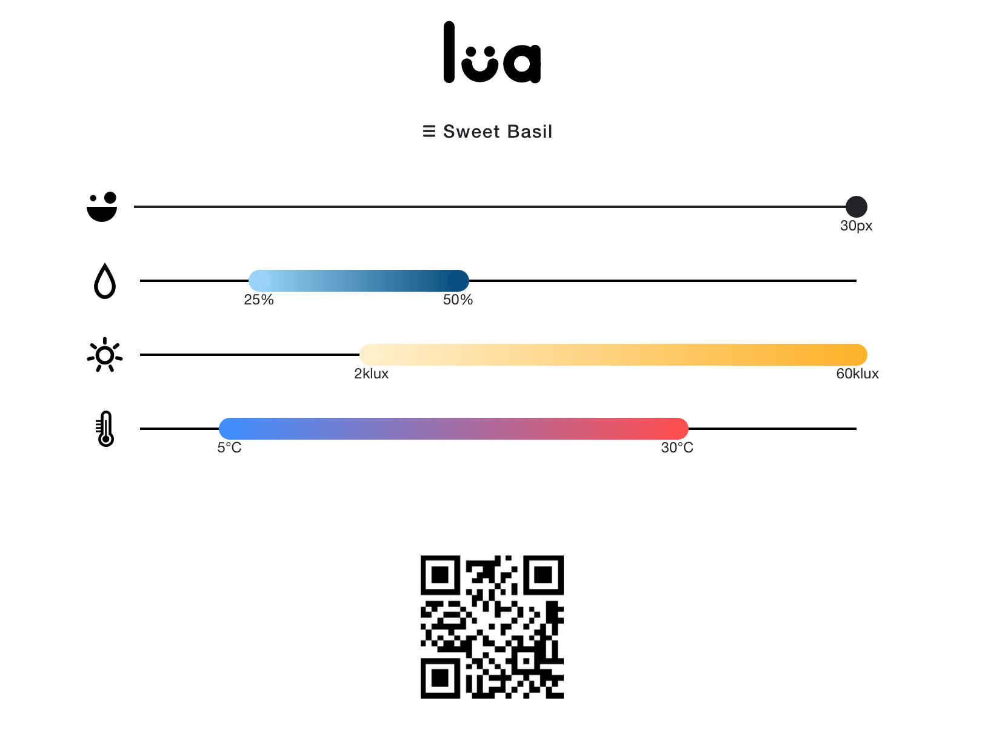

# Lua Planter findings

The Lua planter was an [indigogo campaign](https://www.indiegogo.com/projects/lua-the-smart-planter-with-feelings) that delivered some devices
but failed and was quickly abandoned by the original author.

The device needed the web app at `https://luaplanter.com` for configuration, but that site is down. By luck I have the PWA cached locally, so I can still access it. But I don't know for how long.

I have managed to extract some of the files from the PWA, which are available in the [source](source) directory.  Notably `sw.js` is missing.




## Generated QR codes

Some QR codes are generated from the PWA and decoded using the [zxing.org decoder](https://zxing.org/w/decode.jspx) in order to try to reverse engineer the QR code generation.

### firmware


```
41 14 d0 f0 e0 17 38 62   fc a7 bf 53 a7 57 9e d8
9c cf c0 ec 11 ec 
```

### 7px 10/100% 6/60k lux 0/40C


```
41 15 30 f0 70 02 80 a6   40 00 07 01 70 00 00 00
00 00 00 ec 11 ec 
```

### 7px 10/100% 6/60k lux 0/5C (C end changed to 5)


```
                x x
41 15 30 f0 70 00 50 a6   40 00 07 01 70 00 00 00
00 00 00 ec 11 ec 
```

### 7px 10/100% 6/60k lux 35/40C (C start changed to 35)


```
             x x
41 15 30 f0 72 32 80 a6   40 00 07 01 70 00 00 00
00 00 00 ec 11 ec 
```

### 7px 10/100% 6/37 lux 0/40C (lux end changed to 37)


```
                                 x xx
41 15 30 f0 70 02 80 a6   40 00 00 30 00 00 00 00
00 00 00 ec 11 ec 
```

### 7px 10/100% 47k/60k lux 0/40C (lux start changed to 47k)


```
                           x xx xx xx
41 15 30 f0 70 02 80 a6   43 b1 26 11 70 00 00 00
00 00 00 ec 11 ec 
```

### 7px 10/20% 6/60k lux 0/40C (% end changed to 20)


```
                      x          x xx
41 15 30 f0 70 02 80 a1   40 00 06 11 70 00 00 00
00 00 00 ec 11 ec 
```

### 7px 90/100% 6/60k lux 0/40C (% start changed to 90)


```
                   x             x xx
41 15 30 f0 70 02 85 a6   40 00 06 11 70 00 00 00
00 00 00 ec 11 ec
```

### 30px 10/100% 6/60k lux 0/40C (px end changed to 30)


```
            x                   x  xx
41 15 30 f1 e0 02 80 a6   40 00 06 11 70 00 00 00
00 00 00 ec 11 ec
```

### 30px 25/50% 2k/60k lux 5/30C (Sweet Basil)


```
41 15 30 f1 e0 51 e1 93   2c 80 07 01 70 00 00 00
00 00 00 ec 11 ec 
```

